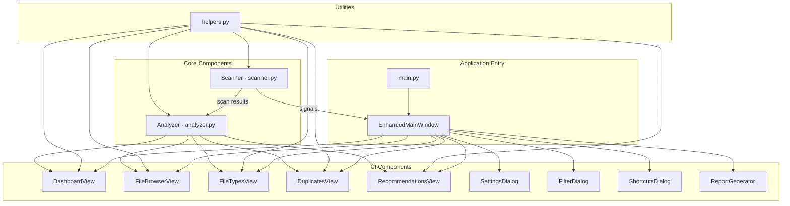

# Storage Stats - Architecture Documentation

## Architecture Overview

Storage Stats is a disk space analyzer application built with Python and PyQt6, designed to help users analyze and visualize how their disk space is being used. The application follows a modular architecture with clear separation of concerns between core functionality and the user interface.

## Architecture Diagram

## Component Descriptions

### Application Entry

- **main.py**: The main entry point of the application, responsible for initializing the application, parsing command-line arguments, setting up logging, and creating the main window.
- **EnhancedMainWindow**: A subclass of MainWindow with improved signal handling to prevent segmentation faults.

### Core Components

- **Scanner (scanner.py)**: Responsible for traversing the file system and collecting data about files and directories. Uses multi-threading for efficient scanning of large file systems.
- **Analyzer (analyzer.py)**: Processes the data collected by the Scanner to identify large files, duplicate files, and generate recommendations.

### UI Components

- **DashboardView**: Provides an overview of disk usage, including total size, largest files/directories, and storage distribution.
- **FileBrowserView**: Allows users to navigate through the file system and see the size of each file and folder.
- **FileTypesView**: Visualizes storage distribution by file types and categories with charts and tables.
- **DuplicatesView**: Allows users to find and manage duplicate files to reclaim wasted space.
- **RecommendationsView**: Provides personalized suggestions for freeing up disk space.
- **SettingsDialog**: Allows users to configure application settings.
- **FilterDialog**: Provides options for filtering scan results.
- **ShortcutsDialog**: Displays keyboard shortcuts available in the application.
- **ReportGenerator**: Generates reports of scan results for saving or sharing.

### Utilities

- **helpers.py**: Contains various utility functions used throughout the application, such as file size formatting, hash calculation, and file type categorization.

## Data Flow

1. The Scanner traverses the file system and collects data about files and directories.
2. The Scanner emits signals to update the UI during scanning.
3. Once scanning is complete, the scan results are passed to the Analyzer.
4. The Analyzer processes the data and provides it to the various UI components.
5. Each UI component displays a different aspect of the analyzed data.

## Signal/Slot Mechanism

The application makes heavy use of PyQt's signal/slot mechanism for communication between components:

- Scanner signals: scan_started, scan_progress, scan_finished, scan_error
- These signals are connected to slots in the MainWindow, which updates the UI accordingly.

## File Formats

- Scan results are stored in memory as Python dictionaries.
- The application can save reports in various formats, including HTML and CSV.
- Partial scans can be saved to disk for resuming later. 